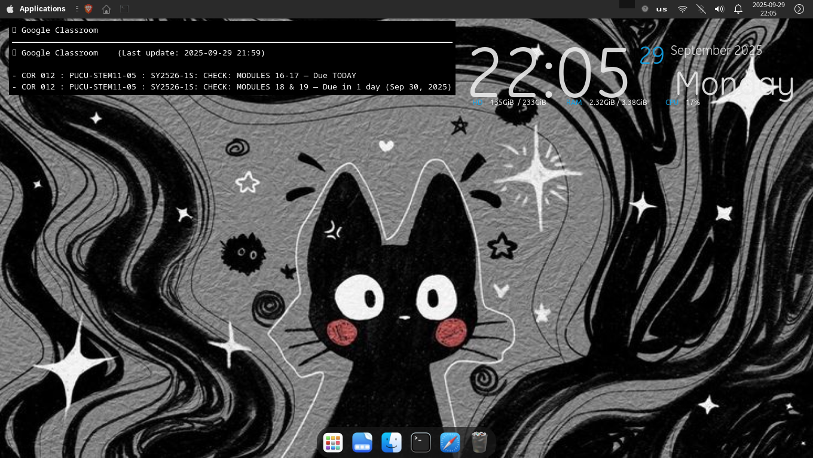

# 📚 Conky Google Classroom Widget

A lightweight **Conky widget** that shows your upcoming **Google Classroom assignments** on your Linux desktop.  

Built with:
- 🐍 Python (Google Classroom API)
- 🐚 Bash (fetch loop + launcher)
- 🎨 Conky (desktop display)

---

## ✨ Features
- Fetches active Google Classroom assignments every 5 minutes
- Displays due dates & statuses:
  - ✅ No upcoming assignments
  - ⏳ Due today / in X days
  - 📅 Due later
- Simple integration with Conky (renders text from a file)
- Runs automatically at startup & after sleep in XFCE

---

## 📂 Files
- `GCR.py` → Fetch assignments, write them to `~/classroom/classroom.txt`
- `run_fetch_loop.sh` → Runs `GCR.py` in an infinite loop (every 5 minutes)
- `start-classroom.sh` → Wrapper script for XFCE autostart (launches loop + Conky)
- `classroom.conf` → Conky config file to display the widget
- `requirements.txt` → Python dependencies

---

## 🚀 Setup

### 1. Clone the repo
```bash
git clone https://github.com/bennyyy143/conky-classroom-widget.git
cd conky-classroom-widget
```

### 2. Create a Python virtual environment & install deps
```bash
python3 -m venv venv
source venv/bin/activate
pip install -r requirements.txt
deactivate
```

### 3. Google API setup
1. Go to [Google Cloud Console](https://console.cloud.google.com/).
2. Enable the **Google Classroom API**.
3. Download your OAuth client file as `credentials.json`.
4. Place it in `~/classroom/` (⚠️ not in the repo — it’s ignored).
5. Run the script once to authenticate:
   ```bash
   ./run_fetch_loop.sh
   ```
   It will open a browser, ask you to log in, and save `token.pickle`.

---

## 🖥️ Running

### Manual test
```bash
bash run_fetch_loop.sh &
conky -c classroom.conf
```

### XFCE autostart
1. Copy `start-classroom.sh` to your `~/bin/` directory:
   ```bash
   cp start-classroom.sh ~/bin/
   chmod +x ~/bin/start-classroom.sh
   ```

2. Create `~/.config/autostart/conky-classroom.desktop`:
   ```ini
   [Desktop Entry]
   Type=Application
   Name=Conky Classroom
   Comment=Show Classroom assignments on desktop
   Exec=/home/YOURUSER/bin/start-classroom.sh
   X-GNOME-Autostart-enabled=true
   NoDisplay=false
   ```

Now the widget will launch automatically when you log in **and restore after sleep**.

---

## 📸 Screenshots


---

## ⚠️ Notes
- **Do not commit `credentials.json`, `token.pickle`, or logs** (they’re ignored by `.gitignore`).
- The widget depends on `~/classroom/classroom.txt` being updated by the loop.
- If you change the Conky config location, update `start-classroom.sh` accordingly.

---

## 📝 License
MIT
